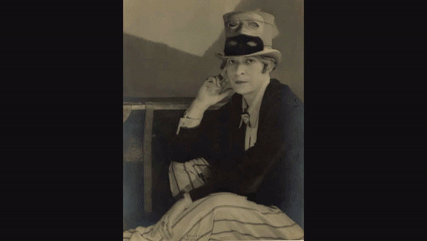

# Art Ancient Through Contemporary

## Summary
Over the weekend I planned on completeing the task that was given to me by my partner which was:

Combine all images they have collected in their personal Art directory and convert them into a 3fps movie.

## Challenges
No matter what the image dimensions were, they should fit into a HD resolution canvas with black padding. Some images
had longer widths than heights and vice versa. Some images were high resolution and some were low resolution. There
were many different image types (jpg, gif, tiff, png) and there were many different variations of file extension naming conventions (jpg, jpeg, JPEG).
There was no consistent file naming structure for the file name or directories.

## Workflow

### Gather the data

From the parent directory, gather all file paths and output into a file:
```
find . -type f ! -name ".DS_Store" | sed 's/\.\///g' | sed 's/\/\//\//g' > library-list.txt
```

to ignore specific directories
```
find . -type f ! -path "./Catalog/*" ! -path "./Backup/*" ! -name ".DS_Store" | sed 's/\.\///g' | sed 's/\/\//\//g' > library-list.txt
```

Search for all file types that do not match what is being selected:
```
cat library-list.txt | awk -F . '{print $NF}' | grep -v -E 'jpg|gif|png|tiff$'
```

#### Basic analysis on the Catalog

9065 total files

8843 files contain '.jpg'

138 files contain '.png'

35 files contain '.gif'

27 files contain '.pdf'

10 files contain '.rtf'

9 files contain '.tiff'

1 file contains '.textClipping'

1 file contains '.html'

1 file contains '.htm'


### Normalize the file extensions
Next we should lowercase all the filenames for sanity and then eventually convert
the jpg naming convention to a single style (jpg was chosen).

`lowercase-file-extensions.sh`
Combination of `gnu-sed`, `find` were used to search for all the files that match
the search parameters and to lowercase the file extensions.

`normalize-file-extensions.sh`
Changes any file named `.jpeg` -> `.jpg`

### Output the images
`resize-images-to-1280x720.sh`
This ended up being a bit more manual of a process than I liked. `ffmpeg` with its
glob pattern it is unable to pick up every file within children directories, so I've had to
change it everytime I travelled into children directories.

The commands usually ran like so:
```
./resize-images-to-1280x720.sh \
-g '05.Contemporary/**/*.png' \
-d 'Library-Resize/05.Contemporary' -s 3566
```

`-g` = glob pattern for `ffmpeg`

`-d` = output directory for images

`-s` = starting number for ffmpeg for where to start in terms of naming output files

#### Solving for the aspect ratio problem
`ffmpeg` has a few key commands that can resize any image into a specified dimenion box
while maintaining its aspect ratio AND adding padding to where there would be empty space:

    `-vf "scale=w=1280:h=720:flags=lanczos:force_original_aspect_ratio=1,pad=1280:720:(ow-iw)/2:(oh-ih)/2"`

- `scale=w=1280:h=720` calls out what the actual output will be
- `flags=lanczos:force_original_aspect_ratio=1` ensures the encoding and that the image while being resized will not have its aspect ratio changed.
- `pad=1280:720:(ow-iw)/2:(oh-ih)/2` calls out the padding dimensions (matches the output video scale) sets the image where x position equals `(output_source_width - input_source_width)/2` and y equals `(output_source_height - input_source_height)/2` which places the image center of the canvas.

    `-q:v 2` was also important in order to maintain the quality of the image since the `flags=lanczos` encoding was still making the images appear blurry.

### Output the movie from the images
After all the images were in a single directory, I targetted `ffmpeg` at the directory and began making movies out of the images themselves. Some of the videos that were generated were over 20 minutes long.

```
ffmpeg -r 3 -i Library-Resize/03.Modernism/film_sequence-%04d.jpg \
-vf "format=yuv420p" \
-codec:v libx264 \
contemporary.mp4
```

Below is a sample gif version of the `.mp4` that was generated:

